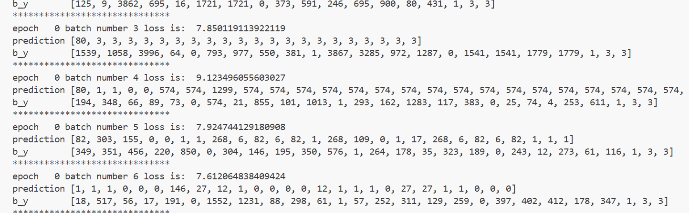
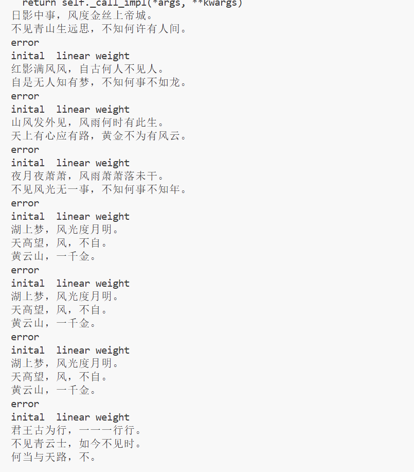

# 第六章 RNN 作业报告

## 2. RNN、LSTM、GRU 模型解释

### 2.1 RNN（Recurrent Neural Network）
RNN 是一种处理序列数据的神经网络。它在每个时间步都会接收当前输入和上一步的隐藏状态，从而把历史信息传递到后续时刻。其核心思想是“参数共享 + 时间递归”，适合文本、语音、时间序列等任务。

RNN 的基本更新形式可写为：

$$
h_t = \tanh(W_x x_t + W_h h_{t-1} + b)
$$

其中，$x_t$ 为当前输入，$h_t$ 为当前隐藏状态。

优点：结构简单、能建模序列依赖。  
缺点：在长序列训练中容易出现梯度消失/梯度爆炸，难以学习长期依赖。

### 2.2 LSTM（Long Short-Term Memory）
LSTM 在 RNN 基础上引入“细胞状态”与门控机制（输入门、遗忘门、输出门），通过门来控制信息写入、保留和输出，从而缓解梯度消失问题。

典型门控形式：

$$
f_t = \sigma(W_f [h_{t-1}, x_t] + b_f)
$$

$$
i_t = \sigma(W_i [h_{t-1}, x_t] + b_i), \quad \tilde{C}_t = \tanh(W_c [h_{t-1}, x_t] + b_c)
$$

$$
C_t = f_t \odot C_{t-1} + i_t \odot \tilde{C}_t
$$

$$
o_t = \sigma(W_o [h_{t-1}, x_t] + b_o), \quad h_t = o_t \odot \tanh(C_t)
$$

优点：擅长建模长距离依赖，训练更稳定。  
缺点：参数量较大，训练与推理开销较高。

### 2.3 GRU（Gated Recurrent Unit）
GRU 可看作 LSTM 的简化版本，将 LSTM 的细胞状态与隐藏状态合并，门控减少为更新门和重置门。参数更少、训练更快，效果在很多任务上与 LSTM 接近。

常见形式：

$$
z_t = \sigma(W_z [h_{t-1}, x_t]), \quad r_t = \sigma(W_r [h_{t-1}, x_t])
$$

$$
	ilde{h}_t = \tanh(W_h [r_t \odot h_{t-1}, x_t])
$$

$$
h_t = (1-z_t) \odot h_{t-1} + z_t \odot \tilde{h}_t
$$

优点：结构更轻量、收敛速度较快。  
缺点：在个别复杂任务上表达能力可能略弱于 LSTM。

### 2.4 三者对比小结
1. RNN：最基础，易实现，但长期依赖能力弱。  
2. LSTM：门控最完整，长期依赖建模能力强。  
3. GRU：在性能与效率之间折中，工程中较常用。

---

## 3. 诗歌生成过程叙述

本实验基于 PyTorch 实现一个字符级诗歌生成模型，整体流程如下：

1. 数据读取与清洗  
读取诗歌文本，去除非法字符和过短/过长样本，为每首诗加上起始标记 `G` 和结束标记 `E`。

2. 建立词表与向量化  
统计所有字符出现频率，构建 `word -> index` 映射，将每首诗转换为索引序列，作为模型输入。

3. 构建训练样本  
采用“下一个字符预测”方式：
- 输入序列：$x = [w_1, w_2, \dots, w_{n-1}]$
- 标签序列：$y = [w_2, w_3, \dots, w_n]$

4. 模型结构  
字符先进入 Embedding 层，再输入两层 LSTM，最后通过全连接层与 LogSoftmax 输出每个时间步的字符概率分布。

5. 训练过程  
损失函数使用 NLLLoss，优化器使用 RMSprop。训练中进行梯度裁剪以减轻梯度爆炸，并定期保存模型参数。

6. 文本生成  
以给定 `begin_word` 作为开头，逐字预测并拼接，直到生成结束标记 `E` 或达到最大长度。最后对生成文本进行格式化打印。

---

## 4. 生成诗歌结果

### 4.1 训练过程截图
- 截图位置（请替换为你的训练截图）：

### 4.2 生成结果截图
要求开头词：`日、红、山、夜、湖、海、月`

## 实验总结

1. 本实验完成了基于 LSTM 的字符级诗歌生成任务，掌握了序列建模的基本流程：数据清洗、序列构造、模型训练与推理生成。  
2. 相比基础 RNN，LSTM/GRU 在长程依赖处理上更稳定，生成文本的连贯性更好。  
3. 生成效果与数据规模、训练轮次、词表覆盖度和解码策略密切相关。训练不足时容易出现重复字词或提前结束。  
4. 后续可尝试改进方向：
    - 使用更大语料与更规范的古诗数据清洗；
	- 使用温度采样、top-k 或 top-p 解码提高多样性；
	- 采用 GRU 或 Transformer 进行效果对比；

